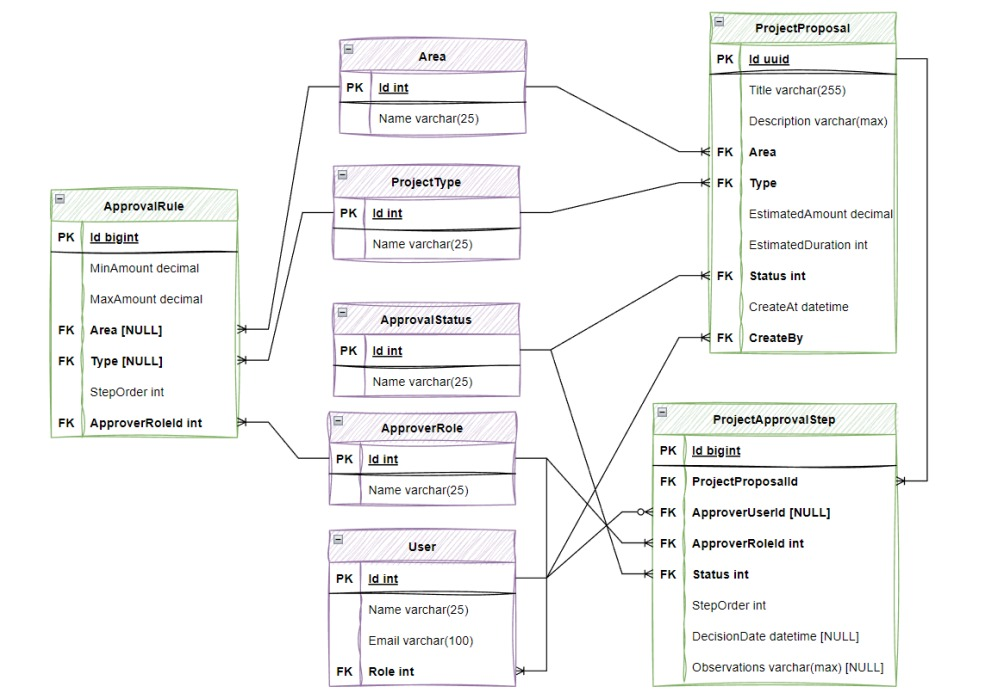

# Aprobación de Proyectos - API RESTful - TP2

Este proyecto es una API RESTful desarrollada en C# con ASP.NET Core y Entity Framework Core como parte de la materia "Proyecto de Software".
Permite crear, consultar, modificar y gestionar dinámicamente solicitudes de proyectos, respetando reglas de negocio predefinidas y flujos de aprobación secuenciales.

---

## Características

La aplicación implementa los criterios funcionales solicitados:

1. Crear una nueva solicitud de proyecto.
2. Buscar proyectos por título, estado, usuario creador y usuario aprobador (siendo filtros opcionales).
3. Realizar el proceso de aprobación, observación o rechazo de propuestas.
4. Visualizar la información del proyecto y el estado de sus pasos de aprobación.
5. Editar una solicitud si se encuentra en estado observado.
6. Listar entidades auxiliares: Área, Tipo de Proyecto, Estado, Usuario, Rol del aprobador.
7. Validación de reglas de negocio:
    - No se permiten proyectos con títulos duplicados.
    - Solo se pueden modificar proyectos en estado observado.
    - Las decisiones pueden modificarse solo si el paso está observado.

---

## Tecnologías utilizadas

- Lenguaje: C# (.NET 8)
- Framework: ASP.NET Core Web API
- ORM: Entity Framework Core (Code First)
- Base de datos: SQL Server (localhost)
- Visualización de API: Swagger (OpenAPI)

---

## Arquitectura del Proyecto

La aplicación sigue el patrón de diseño de software **Clean Architecture**, separando responsabilidades de forma clara en capas independientes:

```
AprobacionProyectos.Api/
├── AprobacionProyectos.Domain/          # Entidades del modelo
├── AprobacionProyectos.Application/     # Lógica de negocio, DTOs, validaciones, interfaces
├── AprobacionProyectos.Infrastructure/  # Persistencia, configuración de EF Core
└── AprobacionProyectos.Api/             # API REST (controladores, configuración)
```

Principios aplicados:

- Clean Code: Código legible, con buenas prácticas y responsabilidades claras.
- SOLID: Diseño orientado a objetos de alta calidad.

---

## Base de datos (partiendo del modelo diseñado en el TP1)

- Implementación Code First con EF Core.
- Migraciones generadas automáticamente.
- Seeders para precarga de datos en tablas como Area, User, ProjectType, etc.
- Esquema coherente con el DER de la Parte 1.
- Uso del patrón Repository.

---

## Diagrama Entidad-Relación (DER):



---

## Endpoints implementados

 - Project:
```
- GET      /api/Project                  Buscar proyectos (con filtros opcionales)
- POST     /api/Project                  Crear nuevo proyecto
- PATCH    /api/Project/{id}/decision    Registrar decisión de aprobación/rechazo/observación
- PATCH    /api/Project/{id}             Modificar proyecto (en estado observado)
- GET      /api/Project/{id}             Buscar proyecto por ID y obtener su información completa
```

 - Information:
```
- GET    /api/Area              Listado de áreas
- GET    /api/ProjectType       Listado de tipos de proyecto
- GET    /api/Role              Listado de roles de usuario
- GET    /api/ApprovalStatus    Listado de estados para un proyecto y pasos de aprobación
- GET    /api/User              Listado de usuarios
```

---

## Ejecución de la aplicación

1. Abrir el proyecto en Visual Studio.
2. Iniciar la aplicación (F5 o dotnet run).
3. Al iniciar, se generará la base de datos automáticamente, aplicando las migraciones necesarias.
4. La API estará disponible en Swagger y puede ser probada desde Postman en cualquiera de estas URLs base:
   - `https://localhost:7017`
   - `http://localhost:5132`
5. Probar los endpoints implementados.

---

## Autor

- Nombre: Diaz Federico
- Año: 2025
- Materia: Proyecto de Software
- Universidad Nacional Arturo Jauretche

---

## Notas

- Este proyecto es un trabajo académico.
- Esta API RESTful es la continuación del Trabajo Práctico Parte 1 (aplicación de consola).
- Puede ser extendida fácilmente para integrarse con una aplicación web frontend o móvil.
